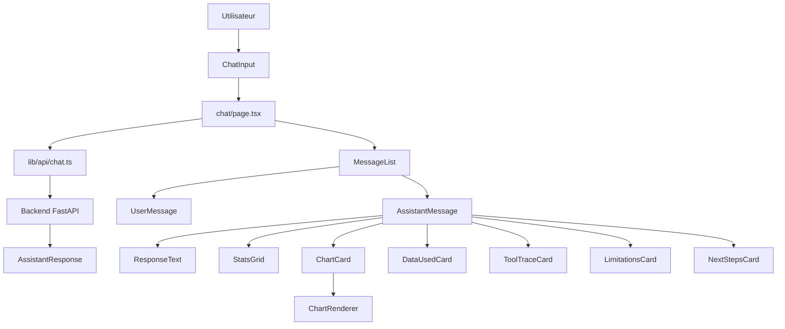

# ARCHITECTURE FRONTEND

```text
frontend/web
├── app/
│   ├── layout.tsx
│   ├── page.tsx
│   ├── globals.css
│   └── chat/
│       └── page.tsx                  # contrôleur principal (state, messages, loading, API calls)
│
├── components/
│   ├── chat/
│   │   ├── ChatShell.tsx             # layout global (header / messages / input)
│   │   ├── MessageList.tsx           # liste des messages + auto-scroll
│   │   ├── MessageBubble.tsx         # wrapper visuel des messages
│   │   ├── AssistantMessage.tsx      # rendu d’une réponse assistant structurée
│   │   ├── UserMessage.tsx           # rendu message utilisateur
│   │   └── ChatInput.tsx             # input + submit + gestion loading
│   │
│   ├── response/
│   │   ├── ResponseText.tsx          # réponse textuelle principale
│   │   ├── StatsGrid.tsx             # indicateurs clés
│   │   ├── ChartCard.tsx             # container de graphique
│   │   ├── ChartRenderer.tsx         # rendu (Recharts)
│   │   ├── DataUsedCard.tsx          # données et filtres utilisés
│   │   ├── ToolTraceCard.tsx         # traçabilité des outils
│   │   ├── LimitationsCard.tsx       # limites de l’analyse
│   │   └── NextStepsCard.tsx         # actions suggérées (cliquables)
│   │
│   └── ui/
│       ├── Card.tsx                  # primitives UI
│       ├── Badge.tsx
│       └── Accordion.tsx
│
├── lib/
│   ├── api/
│   │   └── chat.ts                   # communication avec backend FastAPI
│   ├── mocks/
│   │   └── chat-response.ts          # mock de réponse assistant
│   └── utils/
│       └── chart.ts                  # helpers pour les graphiques
│
├── types/
│   ├── chat.ts                       # contrat AssistantResponse
│   └── message.ts                    # messages (user / assistant / loading)
│
├── public/
├── package.json
├── tsconfig.json
├── next.config.ts
└── eslint.config.mjs
```

